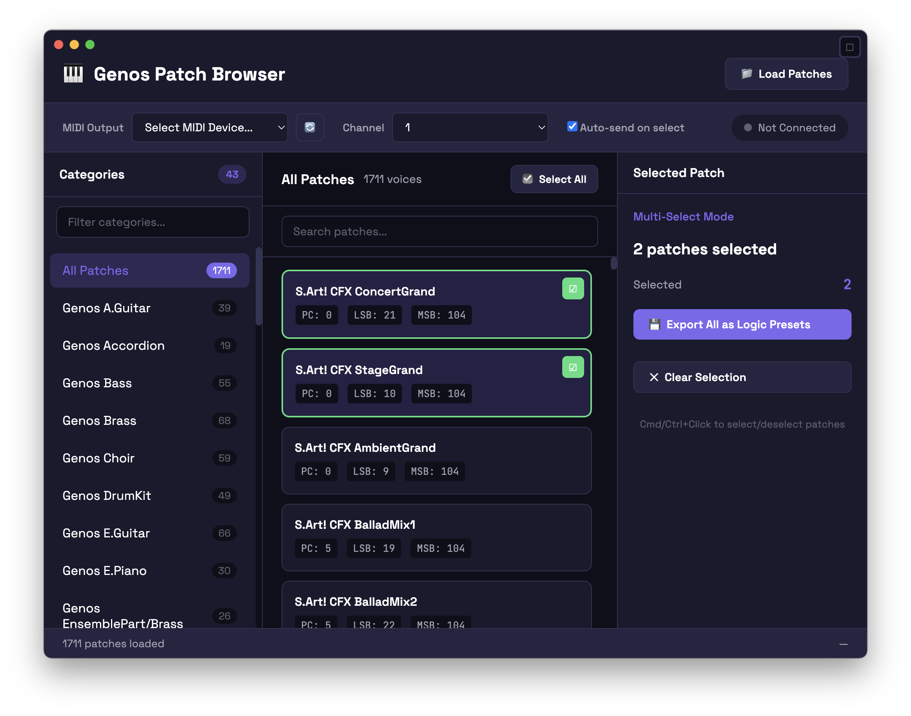

# Genos Patch Browser

A desktop MIDI utility app for browsing and sending patches to the Yamaha Genos workstation.



## Features

- 🎹 Browse all 1,711 Genos voice patches organized by category
- 🔍 Search and filter patches instantly
- 🎵 Send patches directly to your Genos via MIDI
- 💾 Export Logic Pro External Instrument presets (.pst files)
- 📁 Load custom patch lists from JSON files
- 🎛️ Select MIDI channel (1-16)

## Installation

### Prerequisites

- Node.js 18 or later
- npm or yarn

### Setup

1. Clone or download this folder

2. Install dependencies:
   ```bash
   npm install
   ```

3. Run the app:
   ```bash
   npm start
   ```

### Building for Distribution

To create a standalone app:

```bash
# For macOS
npm run build:mac

# For Windows
npm run build:win
```

The built app will be in the `dist` folder.

## Usage

1. **Connect your Genos** via USB-MIDI to your computer

2. **Select MIDI Output** from the dropdown (look for "Digital Workstation Port 1")

3. **Choose MIDI Channel** (default is 1)

4. **Browse patches** by clicking categories on the left

5. **Send a patch** by:
   - Double-clicking any patch card
   - Or selecting a patch and clicking "Send to Genos"

## Exporting Logic Pro Presets

You can now export any Genos voice as a Logic Pro External Instrument preset:

1. **Select a voice** in the browser
2. Click **"Export Logic Preset"** in the details panel
3. Choose where to save the .pst file
4. **Load in Logic Pro** - Open the External Instrument plugin and load your preset

The exported preset automatically configures:
- MIDI destination (MD-BT01 Bluetooth MIDI adapter)
- MIDI channel (1)
- Bank MSB/LSB and Program Change for the selected voice
- Audio input routing (1-2, +8dB gain)
- Auto-compensate latency (enabled)

This eliminates manual Bank Select setup in Logic Pro for each voice!

## Custom Patch Files

You can load your own patch lists by clicking "Load Patches". The JSON format should be:

```json
[
  {
    "category": "Category Name",
    "name": "Patch Name",
    "msb": 0,
    "lsb": 104,
    "pc": 21
  }
]
```

## Troubleshooting

### MIDI device not showing up

- Make sure your Genos is connected via USB and powered on
- Try clicking the refresh button (🔄) next to the MIDI dropdown
- On macOS, you may need to allow MIDI access in System Preferences

### Patches not changing on Genos

- Ensure you've selected the correct MIDI channel
- The Genos should be set to receive program changes on that channel
- Try Port 1 first, then Port 2 if needed

## Technical Details

- Built with Electron
- Uses the `midi` npm package for native MIDI access
- Falls back to Web MIDI API if native MIDI is unavailable

## License

MIT
