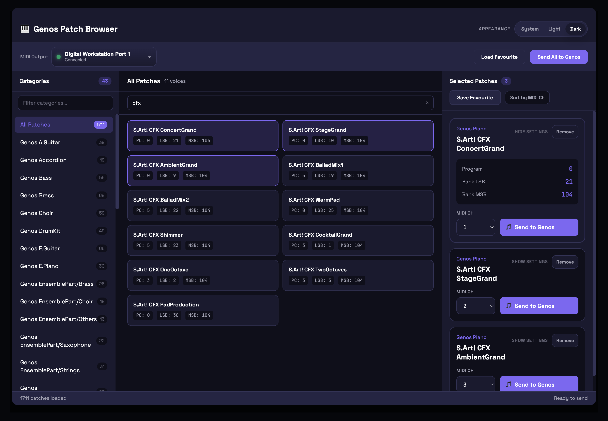

# Genos Patch Browser

A desktop MIDI utility app for browsing and sending patches to the Yamaha Genos workstation.



## Features

- 🎹 Browse all 1,711 Genos voice patches organized by category
- 🔍 Filter categories and patches instantly
- 🗂️ Build a selected patch list with per-patch MIDI channels
- 💾 Save and reload favourite patch lists
- 🎵 Send individual patches or the full selected list to your Genos via MIDI
- 🎨 Switch between system, light, and dark appearance modes

## App Icon (macOS)

- The app includes a piano keyboard icon for the macOS Dock.
- Source SVG: [assets/app-icon.svg](assets/app-icon.svg)
- Generated iconset: [assets/AppIcon.iconset](assets/AppIcon.iconset)
- Packaged mac icon: [assets/AppIcon.icns](assets/AppIcon.icns)

Build the icons:

```bash
npm run icons:build
```

During development (`npm start`) on macOS, the Dock icon uses [assets/dock-icon-512.png](assets/dock-icon-512.png). If missing, Electron falls back to its default icon.

## Installation

### Prerequisites

- Node.js 18 or later
- npm or yarn

### Setup

1. Clone or download this folder

2. Install dependencies:
   ```bash
   npm install
   ```

3. Run the app:
   ```bash
   npm start
   ```

4. Run the automated tests:
   ```bash
   npm test
   ```

### Building for Distribution

To create a standalone app:

```bash
# For macOS
npm run build:mac

# For Windows
npm run build:win
```

The built app will be in the `dist` folder.

## Usage

1. **Connect your Genos** via USB-MIDI to your computer

2. **Select MIDI Output** from the dropdown (look for "Digital Workstation Port 1")

3. **Browse patches** using the category list and patch search

4. **Build a selected list** by clicking the patch cards you want to send

5. **Choose MIDI channels** for selected patches in the right-hand panel

6. **Send patches** by:
   - Clicking "Send to Genos" on an individual selected patch
   - Or clicking "Send All to Genos" in the MIDI bar

7. **Save or reload favourites** to reuse patch sets later

## Troubleshooting

### MIDI device not showing up

- Make sure your Genos is connected via USB and powered on
- Reopen the MIDI output menu to rescan available devices
- On macOS, you may need to allow MIDI access in System Preferences

### Patches not changing on Genos

- Ensure the correct MIDI output is connected before sending
- Ensure each selected patch is assigned to the intended MIDI channel
- The Genos should be set to receive program changes on that channel
- Try Port 1 first, then Port 2 if needed

## Testing

- Run `npm test` for the Node-based tests in `tests/`
- For manual verification, exercise patch loading, category and patch filtering, favourite save/load flows, MIDI connection, and single/bulk send behavior when hardware is available

## Technical Details

- Built with Electron
- Uses the `midi` npm package for native MIDI access
- Falls back to Web MIDI API if native MIDI is unavailable
- Includes automated tests via Node's built-in test runner
- App source now lives under `src/`:
  - Electron entry points: `src/electron/`
  - Renderer HTML/CSS/JS: `src/renderer/`
  - Bundled patch data: `src/data/patches.json`

## Archived Export Code

Logic preset export is currently parked outside the live app flow. The preserved implementation lives in [`archived/export/README.md`](archived/export/README.md) and is not packaged with the app.

## License

MIT
